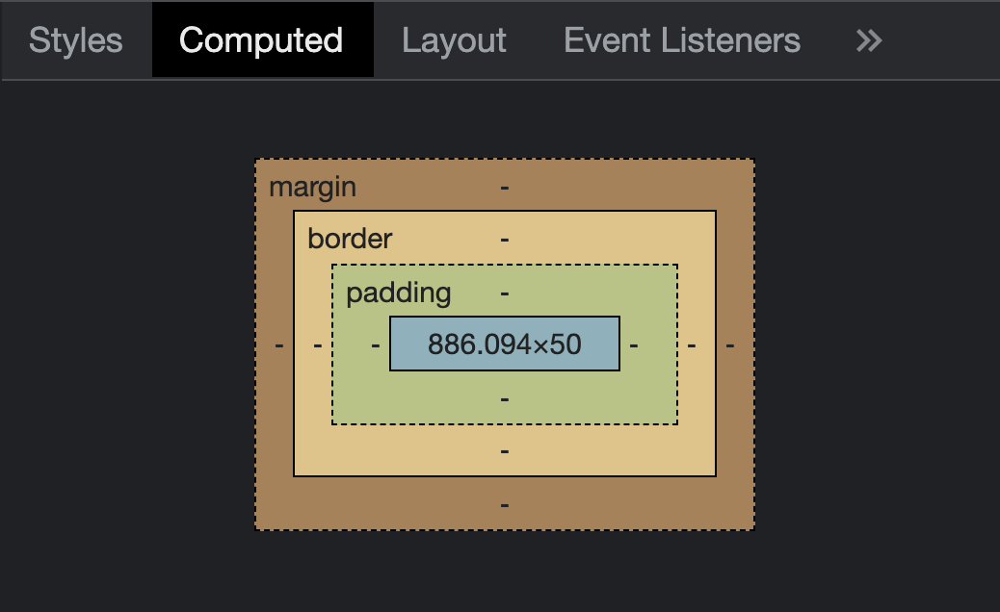

<style>
.centered {
	text-align: center;
}

img.right_side {
  float: right;
  margin:5px 5px 0px 20px;
  width: 30%;
}
img.left_side {
  float:left;
  margin:5px 20px 0px 5px;
  width: 20%;
}

p.clear {
  clear: both;  
}
p.img-container {
  margin-bottom: 15px;
}

p.img-container::after {
  margin-bottom: 15px;
  overflow: hidden;
  clear: both;
}
</style>

# CSS

<p class="img-container">
L'HTML è fin da subito nato come uno standard aperto: questo all'inizio ha creato delle difficoltà, ma con il passare del tempo si è rivelato un aspetto vincente.


</p>

La definizione del CSS è un tipico esempio di quanto detto. Nei primi anni di diffusione (1993-1996) le aziende che crearono i primi browser (Netscape e Internet Explorer in particolare) aggiunsero diverse estensioni proprietarie dell'HTML, generando confusione e difficoltà per gli sviluppatori di pagine web. In altre parole, ciò che funzionava su un browser non funzionava su un altro. Il W3C decise di affrontare questo problema creando un gruppo di lavoro che produsse uno standard nel 1996 chiamato appunto _Cascading Style Sheet_ (CSS).

> Per maggiori dettagli sulla storia del CSS si rimanda a [questa](https://www.w3.org/Style/CSS20/history.html) pagina.

Con il passare degli anni, questa divisione si rivelò estremamente efficace. In particolare, riuscì in modo eccellente a risolvere il problema della diversa dimensione degli schermi dei palmari prima e degli smartphone poi.

CSS include moltissime funzionalità che permette l'animazione degli elementi nelle pagine, le trasformazioni (es. traslazione, rotazione, scalatura), i gradienti e molte altre cose.

# Concetti base

## Sintassi
Cominciamo con la sintassi e la nomenclatura dei vari componenti di un foglio di stile.

Un foglio di stile CSS è formato da un insieme di **regole**. Ogni regola ha la seguente struttura:

<p class="centered">

</p>

Vediamola nel dettaglio. 
1. la regola comincia con un **selettore**, che serve per selezionare su **quali elementi verrà applicata la regola**
1. la seconda parte della regola è la **dichiarazione**, racchiusa in **parentesi graffe**
1. all'interno della dichiarazione c'è una lista di **proprietà**, separate da **punto e virgola**
1. ogni proprietà ha un **nome** ed un **valore**, separati tra loro dai **due punti**

Vediamo alcuni esempi:
```css
/* cambia il colore dello sfondo di tutta la pagina */
body {
  background-color: blue;
}

/* cambia il colore del testo di tutti i paragrafi */
p {
  color: red;
}
```

Di seguito dettagliamo alcune caratteristiche importanti del CSS.

## Specificità
Come detto, CSS è l'acronimo di "Cascading Style Sheet", che si può tradurre come "fogli di stile a cascata". Questo perché è del tutto lecito includere più fogli di stile, o avere più regole all'interno dello stesso foglio di stile, che si riferiscono allo stesso elemento.

Tutte le regole che si potrebbero applicare ad un certo elemento, si chiamano _matching rules_ e si dice che queste regole entrano in competizione tra di loro. Quale vince?

La risposta è: _la regola con specificità più alta_ per quel determinato elemento. Il calcolo della specificità non è banale, ma per ora ci basta sapere che, a parità di altre condizioni, viene applicata la regola definita _per ultima_.

## Elementi inline e block
Un altro concetto fondamentale del CSS è che un elemento può essere di uno di questi due tipi:
- **inline**: si adatta al contenuto
- **block**: si adatta al contenitore

Alcuni elementi sono nativamente inline, ed altri nativamente block.

Ad esempio, i paragrafi sono block e gli span sono inline:
```html
<style>
  p {
    background-color: red;
  }
  span {
    background-color: blue;
  }
</style>

<p><span>ciao</span></p>
```

Questo è il risultato:


Quando nella scrittura della pagina mi servono alcuni elementi inline o block per agganciarli al CSS ma senza un particolare valore semantico, posso usare i seguenti tag:
- `<span>` come generico elemento inline
- `<div>` come generico elemento block

In ogni caso, è sempre possibile cambiare il comportamento di default di un elemento attraverso la proprietà CSS "display":
```css
/* la seguente regola trasforma i paragrafi in elementi inline */
p {
  display: inline;
}
```

> Nota: esiste anche un valore ibrido inline-block, utile in alcune situazioni, per maggiori informazioni vedete [qui](https://www.w3schools.com/css/css_inline-block.asp)

## Box model
L'ultimo concetto CSS che presentiamo in questo pagina è il modello a scatole, in inglese "box model".

Come abbiamo detto, possiamo immaginare la nostra pagina come tante scatole. Come è fatta ognuna di queste scatole?

Ogni scatola è composta delle seguenti parti:
- il **contenuto** vero e proprio, ad esempio il testo, l'immagine o altri elementi annidati, che vogliamo visualizzare
- il **padding**: l'imballaggio, sta all'interno della nostra scatola, quindi coprirà anche l'eventuale colore o immagine di sfondo
- il **border**: la confezione, ovvero il rettangolo che include padding e contenuto
- il **margin**: il margine tra una scatola e l'altra

<style>
.container {
  display: flex;
}
.item {
  background-color: rgba(200, 200, 200, 0.8);
  border: 1px solid rgba(0, 0, 0, 0.8);
  padding: 10px;
  font-size: 30px;
  text-align: center;
}
</style>
<div class="container">
  <div class="item"><br>Contenuto</div>
  <div class="item"><br>Padding</div>
  <div class="item"><br>Bordo</div> 
  <div class="item"><br>Margine</div> 
</div>

Per visualizzare il box model nel browser, andate su ispeziona, ve lo trovate tra i pannelli sviluppatore



Fate attenzione che, generalmente, i margini tra due elementi si sommano: se un elemento ha margine destro pari a 10px, e il successivo ha margine sinistro pari a 15px, il margine totale tra i due elementi sarà 25px.

A questa regola generale ci sono alcune eccezioni. Ad esempio, se ci sono più elementi figli con lo stesso tag, i margini superiore ed inferiore possono _collassare_ tra loro. Per maggiori informazioni, vedete [qui](https://www.w3schools.com/css/css_margin_collapse.asp).

