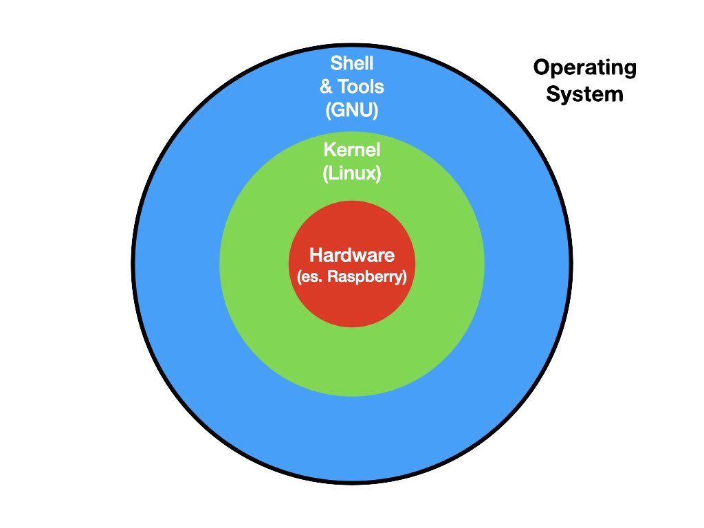
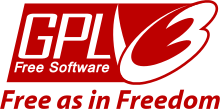

# Organizzazione di un sistema operativo

Il sistema operativo (OS) gestisce le risorse della macchina (memoria, processore, periferiche) per diversi scopi, principalmente:
- astrae il funzionamento dello specifico hardware (es. un particolare monitor o hard-disk), fornendo un'interfaccia comune per gli sviluppatori
- permette a più applicazioni di poter funzionare contemporaneamente, condividendo il processore e la RAM
- evita conflitti nella gestione concorrente delle risorse

Ma ogni cosa ha un suo costo: il sistema operativo utilizza per sé stesso una porzione a volte considerevole delle risorse del nostro computer: pensiamo a quanti GB sul disco occupa una installazione di Windows o Mac, a quanta memoria occupa, alla percentuale di CPU impegnata. Oltre a questo esistono problemi di vulnerabilità, aggiornamento, etc.

> Se  vogliamo far girare un solo programma su un certa macchina (per esempio Arduino), possiamo anche non usare un sistema operativo. Tipicamente questo accade per piccoli elaboratori che devono svolgere compiti molto specifici: questo sistemi vengono chiamati _embedded_ e hanno al loro interno un processore chiamato _microcontrollore_ (mentre i sistemi operativi girano su macchine con _microprocessori_).

Il sistema operativo è una componente software molto complessa: per poter essere gestita in maniera ottimale, è stata divisa in sotto-componenti. Di seguito vediamo i principali.

# Kernel

Per rappresentare i componenti del sistema operativo, si usa spesso la metafora "a guscio", o delle sfere concentriche, in cui al centro di tutto c'è l'hardware.

Il programma che è più vicino all'hardware viene chiamato **kernel**. Noi ci occuperemo in particolare del kernel **Linux**, un kernel open-source.

> Il kernel Linux è stato creato nel 1991 dal finlandese Linus Torvalds ed è distribuito attraverso la licenza di software libero GNU GPLv2. Questa licenza è stata ideata da Richard Stallman (vedi sotto). Linus Torvalds è celebre anche per aver realizzato il software _git_ e per avere un carattere schietto e scontroso. 

Il kernel è la parte dell'OS che si occupa di mediare l'accesso delle applicazioni alle risorse del computer:
 - central processing unit (CPU)
 - memoria volatile (RAM)
 - periferiche di input/output (hard disk, tastiera, mouse, stampanti, etc.)

Il kernel è un programma come gli altri, non ha niente di "magico". In particolare il kernel è un insieme di librerie scritte principalmente in C/C++. Del kernel Linux possiamo anche vederne il [codice sorgente](https://github.com/torvalds/linux), visto che è un software libero e quindi anche aperto.

# Shell
Per usare direttamente il kernel dovremmo scrivere dei programmi in C/C++, ad esempio per interrogare l'hard-disk e farci restituire i file all'interno di una certa cartella. Scrivere un programma per ogni operazione che dobbiamo svolgere però non è molto comodo.

Per poter usare in maniera semplice le chiamate di sistema che ci mette a disposizione il kernel esistono una serie di strumenti che ci facilitano i compito. Per Linux, queste utilità sono state sviluppate dal [progetto GNU](www.gnu.org), e si chiamano **GNU coreutils**.

> Il progetto GNU è stato fondato nel 1983 da Richard Stallman, al MIT di Boston. GNU ha lo scopo in primo luogo di permettere agli sviluppatori di tutto il mondo di poter sviluppare _liberamente_ software, ovvero avendo a disposizione il codice sorgente dei programmi di altre aziende che usano, e senza la necessità di pagare licenze. Le utilità che useremo in questo corso sono solo parte del progetto; un'altra parte fondamentale è la licenza che permette al software di essere usato legalmente, rispettando le libertà fondamentali del free software. Il nome di questa licenza è GPL (General Public Licence), di cui l'ultima versione è la [GPLv3](https://www.gnu.org/licenses/gpl.html) 

Anche in questo caso possiamo andare a cercare il [codice sorgente](http://git.savannah.gnu.org/cgit/coreutils.git). Non ci deve stupire che in questo caso il repository non sia su GitHub, perché è un prodotto Microsoft, mentre GNU utilizza solo software 100% open e free.

# Terminale
Per poter interagire con la shell, abbiamo bisogno di un'applicazione specifica che ci permetta di farlo. Quest'applicazione si chiama "terminale".

Nell'immagine vedete l'applicazione "iTerm2", molto usata in ambito Apple come terminale. Per Windows, consiglio di usare [git bash](https://git-scm.com/downloads).

