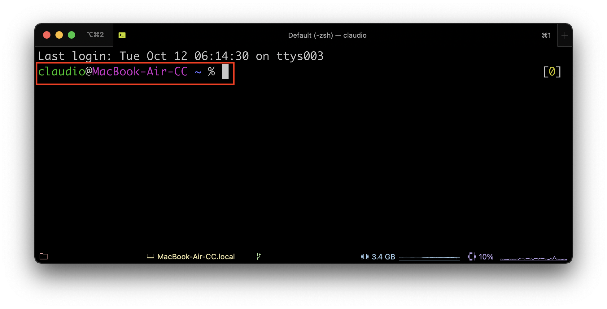
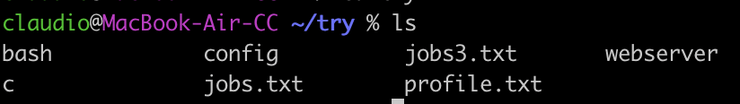

# Uso della shell

Apriamo il nostro terminale e cominciamo a prendere confidenza con le varie componenti.

## Prompt dei comandi
Appena aperto il terminale, notiamo che compare subito una stringa di testo che ci dà varie informazioni. Questa stringa si chiama _prompt dei comandi_, o semplicemente _prompt_.

<p align="center">

</p>


Di solito il prompt contiene:
- il nome dell'utente corrente
- il nome della macchina su cui ci troviamo
- la cartella in cui ci troviamo
- il simbolo $ oppure % che precede il cursore di inserimento

## L'interprete dei comandi
Dopo il prompt possiamo inserire il nostro comando, ad esempio per visualizzare i file nella cartella corrente, possiamo usare `ls`.

<p align="center">

</p>

Vediamo cosa è successo dietro le quinte:
- la stringa che scriviamo, in questo caso `ls`, viene passata all'interprete dei comandi, ovvero la "shell" vera e propria
- la shell interpreta il comando e fa le chiamate di sistema necessarie al kernel
- ritorna su schermo l'output del comando

### Comando, argomenti e opzioni
Il _comando_ vero e proprio è sempre la parola che viene scritta subito dopo il prompt. Un comando può opzionalmente essere seguito da degli _argomenti_, separati da spazi.

Ad esempio, `ls nomefile` mostra solo il file specificato nell'argomento.

<p align="center">

</p>

Se l'argomento comincia con un trattino, prende il nome di _opzione_. Un'opzione serve per modificare il funzionamento del comando in qualche modo.

Ad esempio, l'opzione `-l` del comando `ls` mostra più dettagli sui file.

<p align="center">

</p>

Un'opzione che comincia con un singolo trattino (`-`) è detta "short option" e l'opzione stessa è un singolo carattere, ad esempio `-l`. Un'opzione che comincia con due trattini (`--`) e detta "long option" ed è una parola intera, ad esempio `--version`.

Attenzione: tra il comando e le opzioni ci __deve__ essere uno spazio. Se scrivete `ls-l`, questo verrà interpretato tutto insieme come il nome di un comando.


### Informazioni su un comando
Per visualizzare le informazioni relative ad un comando, in base al sistema che usate potete usare una delle seguenti strategie:

```sh
$ man nomecomando  # apre una finestra nel prompt con i dettagli, per uscire premere q
$ nomecomando --help # stampa direttamente sul terminale i dettagli
```

Normalmente si usa la prima modalità, ma git bash usa la seconda.

## Variabili
Con la shell si possono usare le variabili. Il terminale mette a disposizione un certo numero di _variabili di ambiente_, che vengono definite ogni volta che viene aperta una nuova finestra.

Tutte le variabili, quando sono richiamate, devono essere precedute dal simbolo del dollaro (`$`).

Per visualizzare il valore della variabile, possiamo usare il comando `echo`. Ad esempio, esiste una variabile d'ambiente si chiama `SHELL` e contiene il percorso al programma della shell stessa.

```sh
$ echo $SHELL
/usr/bin/bash
```

Se richiamo la variabile senza dollaro, non viene interpretata correttamente:
```sh
$ echo SHELL
SHELL
```

Notate anche che la shell è _case sensitive_:
```sh
$ echo $shell

```

Come vedete, se provo a stampare una variabile che non esiste, mi ritorna una stringa vuota.

Altre variabili di ambiente utili sono:
```sh
$ echo $TERM # mostra lo standard seguito dal terminale in uso
xterm
$ echo $PROMPT # mostra il prompt corrente
%F{green}%n%f@%F{magenta}%m%f %F{blue}%B%~%b%f %#
```

Per visualizzare tutte le variabili di ambiente, potete usare il comando `env`.


